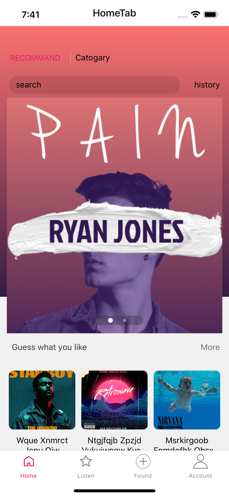

# audioShareApp

## Table of contents

- [General info](#general-info)
- [Setup](#setup)
- [Screenshot](#Screenshot)
- [Technologies](#Technologies)

## General info

Use react native to create an app for audio sharing. And using the [fastmock](https://www.fastmock.site) to mock the api for the app.

## Setup

```
git clone git@github.com:yinmay/audioShareApp.git

yarn

yarn start

yarn ios // for ios simulator

yarn android // for android simulator

```

## Screenshot



<video id="video" controls="" preload="none" poster="./src/assets/videos/videos.mp4">
      <source id="mp4" src="./src/assets/videos/videos.mp4" type="video/mp4">
</videos>

<video id="video" controls="" preload="none" poster="https://blog-static.cnblogs.com/files/douzujun/logisticRegression.js" type="video/mp4">
<source id="mp4" src="https://blog-static.cnblogs.com/files/douzujun/logisticRegression.js" type="video/mp4">
</video>

## Technologies

Project is created with:

- React Native UI library, like Flex Style,View/Image/Text/FlatList, TouchableOpacity, Animated, StyleSheet
- dva.js, React and redux based, lightweight and elm-style framework
- react-navigation for the routing and navigation
- react-native-storage to save the data in local, just like winodw.localstorage for web
- react-native-linear-gradient
- react-native-snap-carousel
- axios to fetch data
- dynamicly generate models in dva
- drag and drop category
- use mockjs and FastMock to mock api and create fake data for frontend
- blur image background
- react-native-gesture-handler for the gesture of native
